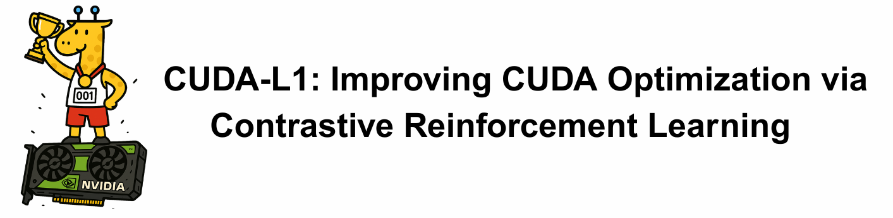
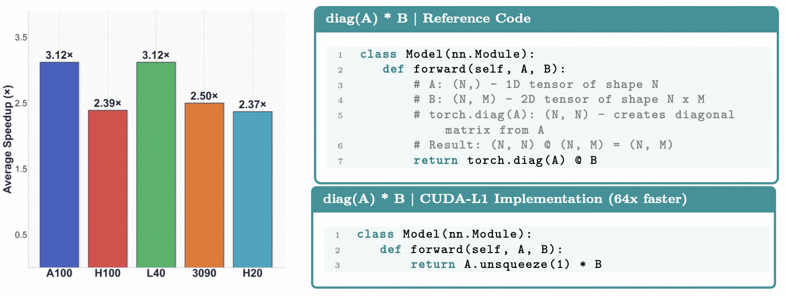
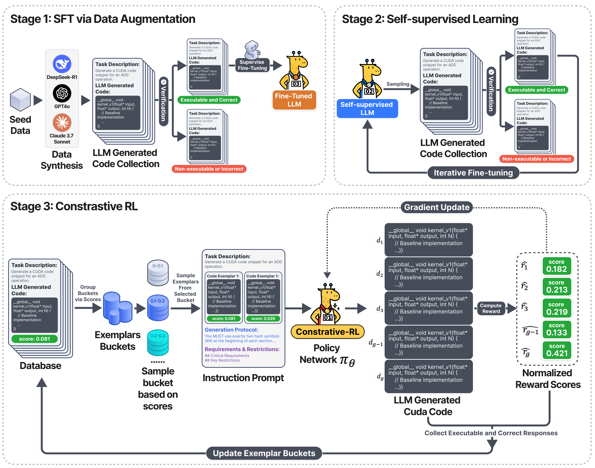

<div align="center">
  <picture>
      
  </picture>
</div>

<hr>


<p align="center">
<a href="https://github.com/deepreinforce-ai/CUDA-L1/blob/main/LICENSE"></a> &nbsp;&nbsp;&nbsp; | &nbsp;&nbsp;&nbsp; <b>🏠&nbsp;&nbsp;<a href="https://deepreinforce-ai.github.io/cudal1_blog/">Project Page</a></b> &nbsp;&nbsp;&nbsp; | &nbsp;&nbsp;&nbsp; <b>📄&nbsp;&nbsp;<a href="https://arxiv.org/abs/2507.14111">Paper</a></b> &nbsp;&nbsp;&nbsp; | &nbsp;&nbsp;&nbsp; <b>🔥&nbsp;&nbsp;<a href="https://deep-reinforce.com/cuda_l1">Demo</a></b>
</p>


<div align="center">
  <picture>
      
  </picture>
</div>

## Introduction

In this paper, we introduce CUDA-L1, an automated reinforcement learning (RL) framework for CUDA optimization. The core of CUDA-L1 is a contrastive RL model, a newly-designed RL system to enhance optimization through comparative learning. 
CUDA-L1 achieves unprecedented performance improvements on the CUDA optimization task:
trained on NVIDIA A100, it delivers an average speedup of **x3.12** with a median speedup of **x1.42** across all 250 CUDA kernels of KernelBench, with peak speedups reaching **x120**. Furthermore, the model also demonstrates portability across GPU architectures, achieving average speedups of **x3.12** (median **x1.31**) on L40, **x2.50** (median **x1.18**) on RTX 3090, **x2.39** (median **x1.32**) on H100, and **x2.37** (median **x1.34**) on H20 despite being optimized specifically for A100. Beyond these benchmark results, CUDA-L1 demonstrates several remarkable properties:

- It discovers a variety of CUDA optimization techniques and learns to combine them strategically to achieve optimal performance;
- It uncovers fundamental principles of CUDA optimization, such as the multiplicative nature of optimizations and how certain "gatekeeper" techniques must be applied first to unlock the effectiveness of others;
- It identifies non-obvious performance bottlenecks (such as CPU-GPU synchronization dominating compute optimizations) and rejects seemingly beneficial optimizations that actually harm performance.


<div align="center">
  <picture>
      
  </picture>
<br>
 <p align="center">
    <strong>Fig (left)</strong>：Average speedup across different architectures on KernelBench; <strong>Fig (right)</strong>: A showcase of <em>diag(A) * B</em> reference and CUDA-L1 implementations. The optimized implementation reduces complexity from <strong>O(N²M)</strong> to <strong>O(NM)</strong>, achieving <strong>64×</strong> speedup by replacing full matrix multiplication with element-wise operations.
</p>
</div>


## 🥳 NUpdates
* **[17 Jul, 2025]** The repository is created and we release the first version.

## To-do List
- [x] Fix KernelBench evaluations with proper stream timing synchronization
- [ ] Remove caching
- [ ] Compare with torch.compile
- [ ] Compare with pytorch eager + cuda graph


### How CUDA-L1 Works?

<div align="center">
  <picture>
      
  </picture>
</div>

#### Stage 1: Supervised Learning
We augment the training dataset with CUDA code variants generated by LLMs and fine-tune the base model on executable and correct implementations to establish foundational CUDA knowledge.

#### Stage 2: Self-Supervised Learning  
The model iteratively generates CUDA kernels, validates their correctness and executability, and trains on successfully validated examples, enabling autonomous improvement without human supervision.

#### Stage 3: Contrastive Reinforcement Learning
We employ contrastive learning with execution-time rewards, training the model to distinguish between faster and slower CUDA implementations, ultimately optimizing for superior performance.


## Evaluation Results

#### Performance on KernelBench

<div align="center">
<table>
<thead>
<tr>
<th align="center">Method</th>
<th align="center">Mean</th>
<th align="center">Max</th>
<th align="center">75%</th>
<th align="center">50%</th>
<th align="center">25%</th>
<th align="center">Success<br><sup># out of total</sup></th>
<th align="center">Speedup<br><sup># out of total</sup></th>
</tr>
</thead>
<tbody>
<tr>
<td align="center"><strong>All Levels</strong></td>
<td align="center"><strong>3.12×</strong></td>
<td align="center"><strong>120×</strong></td>
<td align="center">2.25×</td>
<td align="center">1.42×</td>
<td align="center">1.17×</td>
<td align="center">249/250</td>
<td align="center">240/250</td>
</tr>
<tr>
<td align="center">Level 1</td>
<td align="center">2.78×</td>
<td align="center">65.8×</td>
<td align="center">1.75×</td>
<td align="center">1.28×</td>
<td align="center">1.12×</td>
<td align="center">99/100</td>
<td align="center">94/100</td>
</tr>
<tr>
<td align="center">Level 2</td>
<td align="center">3.55×</td>
<td align="center">120×</td>
<td align="center">2.05×</td>
<td align="center">1.39×</td>
<td align="center">1.20×</td>
<td align="center">100/100</td>
<td align="center">98/100</td>
</tr>
<tr>
<td align="center">Level 3</td>
<td align="center">2.96×</td>
<td align="center">24.9×</td>
<td align="center">2.60×</td>
<td align="center">1.94×</td>
<td align="center">1.42×</td>
<td align="center">50/50</td>
<td align="center">48/50</td>
</tr>
</tbody>
</table>
</div>

#### Cross-GPU Performance

<div align="center">
<table>
<thead>
<tr>
<th align="center">GPU Device</th>
<th align="center">Mean</th>
<th align="center">Max</th>
<th align="center">75%</th>
<th align="center">50%</th>
<th align="center">25%</th>
<th align="center">Success Rate</th>
</tr>
</thead>
<tbody>
<tr>
<td align="center">A100 PCIe</td>
<td align="center"><strong>3.12×</strong></td>
<td align="center">120×</td>
<td align="center">2.25×</td>
<td align="center">1.42×</td>
<td align="center">1.17×</td>
<td align="center"><strong>99.6%</strong></td>
</tr>
<tr>
<td align="center">H100</td>
<td align="center">2.39×</td>
<td align="center">81.9×</td>
<td align="center">1.76×</td>
<td align="center">1.32×</td>
<td align="center">1.09×</td>
<td align="center">100%</td>
</tr>
<tr>
<td align="center">RTX 3090</td>
<td align="center">2.50×</td>
<td align="center">114×</td>
<td align="center">1.57×</td>
<td align="center">1.18×</td>
<td align="center">1.03×</td>
<td align="center">96.8%</td>
</tr>
<tr>
<td align="center">L40</td>
<td align="center"><strong>3.12×</strong></td>
<td align="center">182×</td>
<td align="center">1.89×</td>
<td align="center">1.31×</td>
<td align="center">1.08×</td>
<td align="center">99.2%</td>
</tr>
<tr>
<td align="center">H20</td>
<td align="center">2.37×</td>
<td align="center">63.7×</td>
<td align="center">1.81×</td>
<td align="center">1.34×</td>
<td align="center">1.11×</td>
<td align="center">98.8%</td>
</tr>
</tbody>
</table>
</div>


<sup>
• CUDA-L1 was trained on A100 GPUs but shows excellent transfer to other architectures
</sup><br/><sup>
• Level 3 tasks (complex ML operations) show the highest speedups, making CUDA-L1 especially valuable for real-world applications
</sup>


## Want to reproduce our results?

We provide CUDA code snippets optimized by CUDA-L1 in the `optimized_cuda_code` folder, with separate versions for each GPU device. For example, to reproduce our results on H100 XSM, download `./optimized_cuda_code/h100_xsm.json` and run each code snippet on your H100 device.


## Limitations and Challenges

During the training process, we found that RL is particularly susceptible to reward hacking. We've already identified quite a few hacking cases (e.g., exploiting timing measurements & caching results). If you identify any additional reward hacks in the code, we would greatly appreciate you letting us know. 


## Citation
```latex
@article{deepreinforce2025cudal1,
  title={CUDA-L1: Improving CUDA Optimization via Contrastive Reinforcement Learning},
  author={Li, Xiaoya and Sun, Xiaofei and Wang, Albert and Li, Jiwei and Chris, Shum},
  journal={arXiv preprint arXiv:2507.14111},
  year={2025}
}
```

## Contact
If you have any questions, please reach out to us at **research@deep-reinforce.com**.
