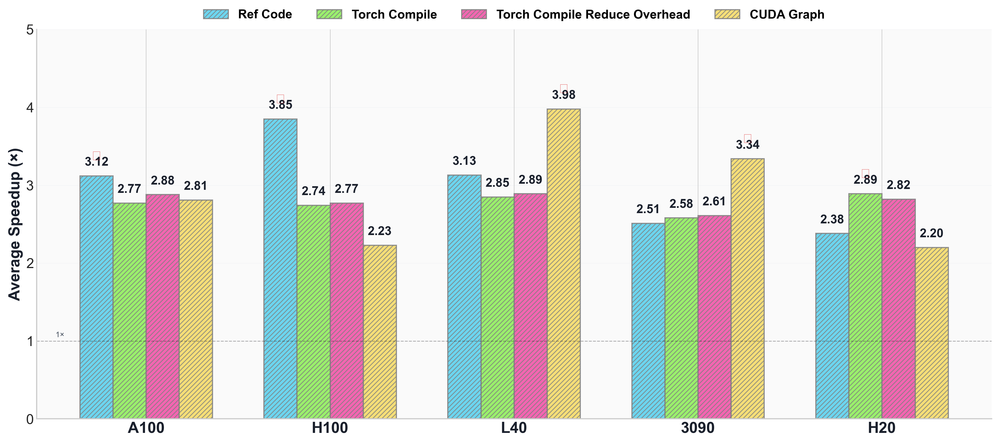

<div align="center">
  <picture>
      
  </picture>
</div>

<hr>


<p align="center">
<a href="https://github.com/deepreinforce-ai/CUDA-L1/blob/main/LICENSE"></a> &nbsp;&nbsp;&nbsp; | &nbsp;&nbsp;&nbsp; <b>🏠&nbsp;&nbsp;<a href="https://deepreinforce-ai.github.io/cudal1_blog/">Project Page</a></b> &nbsp;&nbsp;&nbsp; | &nbsp;&nbsp;&nbsp; <b>📄&nbsp;&nbsp;<a href="https://arxiv.org/abs/2507.14111">Paper</a></b> &nbsp;&nbsp;&nbsp; | &nbsp;&nbsp;&nbsp; <b>🔥&nbsp;&nbsp;<a href="https://deep-reinforce.com/cuda_l1">Demo</a></b>
</p>


<div align="center">
  <picture>
      
  </picture>
</div>

## 🥳 Introduction

In this paper, we introduce CUDA-L1, an automated reinforcement learning (RL) framework for CUDA optimization. The core of CUDA-L1 is a contrastive RL model, a newly-designed RL system to enhance optimization through comparative learning. 

<div align="center">
  <picture>
      
  </picture>
<br>
 <p align="center">
    <strong>Fig</strong>：Average speedup across different architectures on KernelBench over baselines.
</p>
</div>


## 🗒️ To-do List
- [x] Fix KernelBench evaluations with proper stream timing synchronization ✅
- [x] Remove caching ✅
- [x] Compare with torch.compile ✅
- [x] Compare with pytorch eager + cuda graph ✅
- [x] Compare with custom torch CUDA/cuDNN backend flags ✅
- [ ] 5090/4090


## 🩺 Evaluation Results

Our evaluation is conducted on the KernelBench [dataset](https://github.com/ScalingIntelligence/KernelBench), a collection of 250 PyTorch workloads designed to evaluate language models' ability to generate efficient GPU kernels. 

</table>

</div>

<div align="center">

<table>

<thead>

<tr>

<th align="center">Configuration</th>

<th align="center">Method</th>

<th align="center">Mean</th>

<th align="center">Max</th>

<th align="center">75%</th>

<th align="center">50%</th>

<th align="center">25%</th>

<th align="center">Success↑<br><sup># out of total</sup></th>

<th align="center">Speedup↑<br><sup>>1.01x out of total</sup></th>

</tr>

</thead>

<tbody>

<tr>

<td rowspan="4" align="center"><em>Default</em></td>

<td align="center"><strong>All</strong></td>

<td align="center"><strong>3.12×</strong></td>

<td align="center"><strong>120×</strong></td>

<td align="center">2.25×</td>

<td align="center">1.42×</td>

<td align="center">1.17×</td>

<td align="center">249/250</td>

<td align="center">226/250</td>

</tr>

<tr>

<td align="center">Level 1</td>

<td align="center">2.78×</td>

<td align="center">65.8×</td>

<td align="center">1.75×</td>

<td align="center">1.28×</td>

<td align="center">1.12×</td>

<td align="center">99/100</td>

<td align="center">80/100</td>

</tr>

<tr>

<td align="center">Level 2</td>

<td align="center">3.55×</td>

<td align="center">120×</td>

<td align="center">2.05×</td>

<td align="center">1.39×</td>

<td align="center">1.20×</td>

<td align="center">100/100</td>

<td align="center">98/100</td>

</tr>

<tr>

<td align="center">Level 3</td>

<td align="center">2.96×</td>

<td align="center">24.9×</td>

<td align="center">2.60×</td>

<td align="center">1.94×</td>

<td align="center">1.42×</td>

<td align="center">50/50</td>

<td align="center">48/50</td>

</tr>

<tr style="border-top: 1px solid #ddd;">

<td rowspan="4" align="center"><em>Torch Compile</em></td>

<td align="center"><strong>All</strong></td>

<td align="center">2.77×</td>

<td align="center">69.0×</td>

<td align="center">2.55×</td>

<td align="center">1.72×</td>

<td align="center">1.14×</td>

<td align="center">249/250</td>

<td align="center">203/250</td>

</tr>

<tr>

<td align="center">Level 1</td>

<td align="center">3.04×</td>

<td align="center">59.7×</td>

<td align="center">2.71×</td>

<td align="center">1.99×</td>

<td align="center">1.41×</td>

<td align="center">99/100</td>

<td align="center">89/100</td>

</tr>

<tr>

<td align="center">Level 2</td>

<td align="center">2.91×</td>

<td align="center">69.0×</td>

<td align="center">1.99×</td>

<td align="center">1.55×</td>

<td align="center">1.10×</td>

<td align="center">100/100</td>

<td align="center">78/100</td>

</tr>

<tr>

<td align="center">Level 3</td>

<td align="center">1.98×</td>

<td align="center">8.57×</td>

<td align="center">2.28×</td>

<td align="center">1.68×</td>

<td align="center">1.00×</td>

<td align="center">50/50</td>

<td align="center">36/50</td>

</tr>

<tr style="border-top: 1px solid #ddd;">

<td rowspan="4" align="center"><em>Torch Compile RO</em></td>

<td align="center"><strong>All</strong></td>

<td align="center">2.88×</td>

<td align="center">80.1×</td>

<td align="center">2.48×</td>

<td align="center">1.67×</td>

<td align="center">1.13×</td>

<td align="center">249/250</td>

<td align="center">200/250</td>

</tr>

<tr>

<td align="center">Level 1</td>

<td align="center">3.38×</td>

<td align="center">55.3×</td>

<td align="center">3.02×</td>

<td align="center">2.29×</td>

<td align="center">1.61×</td>

<td align="center">99/100</td>

<td align="center">90/100</td>

</tr>

<tr>

<td align="center">Level 2</td>

<td align="center">3.00×</td>

<td align="center">80.1×</td>

<td align="center">2.06×</td>

<td align="center">1.54×</td>

<td align="center">1.10×</td>

<td align="center">100/100</td>

<td align="center">79/100</td>

</tr>

<tr>

<td align="center">Level 3</td>

<td align="center">1.62×</td>

<td align="center">8.67×</td>

<td align="center">1.76×</td>

<td align="center">1.13×</td>

<td align="center">0.991×</td>

<td align="center">50/50</td>

<td align="center">31/50</td>

</tr>

<tr style="border-top: 1px solid #ddd;">

<td rowspan="4" align="center"><em>CUDA Graph</em></td>

<td align="center"><strong>All</strong></td>

<td align="center">2.81×</td>

<td align="center">97.9×</td>

<td align="center">1.83×</td>

<td align="center">1.20×</td>

<td align="center">0.954×</td>

<td align="center">249/250</td>

<td align="center">147/229</td>

</tr>

<tr>

<td align="center">Level 1</td>

<td align="center">3.18×</td>

<td align="center">59.6×</td>

<td align="center">2.09×</td>

<td align="center">1.38×</td>

<td align="center">1.04×</td>

<td align="center">99/100</td>

<td align="center">68/88</td>

</tr>

<tr>

<td align="center">Level 2</td>

<td align="center">2.84×</td>

<td align="center">97.9×</td>

<td align="center">1.55×</td>

<td align="center">1.08×</td>

<td align="center">0.932×</td>

<td align="center">100/100</td>

<td align="center">53/94</td>

</tr>

<tr>

<td align="center">Level 3</td>

<td align="center">2.06×</td>

<td align="center">24.6×</td>

<td align="center">1.74×</td>

<td align="center">1.08×</td>

<td align="center">0.887×</td>

<td align="center">50/50</td>

<td align="center">26/47</td>

</tr>

</tbody>

</table>

</div>

<sup>
• RO = Reduce Overhead
</sup><br/><sup>
• Success and Speedup indicate the number of successful benchmarks out of the total for each level
</sup><br/>


<sup>
• CUDA-L1 was trained on A100 GPUs but shows excellent transfer to other architectures
</sup><br/><sup>
• Level 3 tasks (complex ML operations) show the highest speedups, making CUDA-L1 especially valuable for real-world applications
</sup>


## ❓ How to reproduce the results?

We provide CUDA code snippets optimized by CUDA-L1 in the `optimized_cuda_code` folder, with separate versions for each GPU device. For example, to reproduce our results on H100 XSM, download `./optimized_cuda_code/h100.json` and run each code snippet on your H100 device.


## 📁 Structure of Release Code

Each line in the release file contains a JSON object with the following fields:

| Field | Description |
|-------|-------------|
| `level_id` | Level index in KernelBench (values: 1, 2, 3) |
| `task_id` | Task index for that level |
| `ref_code` | Reference CUDA code provided by KernelBench |
| `custom_code` | Optimized code generated by CUDA-L1 |
| `cuda_graph_code` | KernelBench reference code with CUDA Graph modifications |
| `score_default` | Execution time ratio: ref_code / custom_code |
| `score_torch_compile_default` | Execution time ratio: ref_code / custom_code (with torch.compile) |
| `score_torch_compile_reduce_overhead` | Execution time ratio: ref_code / custom_code (with torch.compile reduce_overhead mode) |
| `score_cuda_graph` | Execution time ratio: cuda_graph_code / custom_code |

**Note:** If `custom_code` is None, it means the RL either failed to generate code faster than the reference code or simply copied the reference code during generation.

### Example Entry Structure
```json
{
  "level_id": 1,
  "task_id": 1,
  "ref_code": "import torch...",
  "custom_code": "import torch...",
  "cuda_graph_code": "import torch...",
  "score_default": 1.762,
  "score_torch_compile_default": 1.958,
  "score_torch_compile_reduce_overhead": 2.118,
  "score_cuda_graph": 1.566,
}
```

## 🔭 Limitations and Challenges

During the training process, we found that RL is particularly susceptible to reward hacking. We've already identified quite a few hacking cases (e.g., exploiting timing measurements & caching results). If you identify any additional reward hacks in the code, we would greatly appreciate you letting us know. 


## 📇 Citation
```latex
@article{deepreinforce2025cudal1,
  title={CUDA-L1: Improving CUDA Optimization via Contrastive Reinforcement Learning},
  author={Li, Xiaoya and Sun, Xiaofei and Wang, Albert and Li, Jiwei and Chris, Shum},
  journal={arXiv preprint arXiv:2507.14111},
  year={2025}
}
```

## ✉️ Contact
If you have any questions, please reach out to us at **research@deep-reinforce.com**.
